# Kafka

## 消息队列
Message Queue，消息队列中间件。MQ 的真正目的是为了通信，屏蔽底层复杂的通信协议，定义了一套应用层的、更加简单的通信协议，一个分布式系统中的两个模块间通信要么是HTTP，要么是自己开发的（rpc）TCP，但这两种协议都是原始的协议，MQ 所要做的是在这些协议上构建一个简单的协议————生产者/消费者模型
MQ 带来的不是具体的通信协议，而是更高层次的通信模型。他定义了两个对象————生产者、消费者，提供一个 SDK 让我们可以自定义自己的生产者和消费者实现消息通信而无视底层通信协议

## 分类

1. 有 broker 
   通常有一台服务器作为 Broker，所有的消息都通过它中转，生产者把消息发送给它就结束自己的任务了，Broker 则把消息主动推送给消费者（或者消费者主动轮询）
   1. 重 Topic
   2. 轻 Topic
2. 无 broker 


## Kafka 基础知识
### 安装
1. 安装 JDK 
2. 下载 Kafka
3. 启动 zookeeper
4. 启动 kafka-server

### 基本概念
|名称|解释|
|-|-|
|Broker|消息中间件处理节点，一个Kafka节点就是一个broker，一个或多个broker可以组成Kafka集群|
|Topic|Kafka根据topic对消息进行归类，发布到Kafka集群的每条消息都需要指定一个topic|
|producer|消息生产者|
|consumer|消息消费者|
|Consumer Group|每个consumer属于一个特定的consumer group，一条消息能被多个group消费，但每个group中只有一个consumer能消费该消息|
|partition|一个topic可分为多个partition，每个partition中的消息都是有序的|


### 创建 Topic
```shell
bin/kafka-topics.sh --create --topic quickstart-events --bootstrap-server localhost:9092
```

查看 topic
```shell
kafka-topics.sh --list --zookeeper localhost:2181

bin/kafka-topics.sh --describe --topic quickstart-events --bootstrap-server localhost:9092
```

### 发送消息

### 消费消息

- 消息会被顺序存储
- 消费时可指定偏移量

### 单播消息
一个消费组里只有一个消费者能够消费某一消息，可以创建多个消费者，这些消费者在同一消费组中
```shell
./kafka-console-consumer.sh --topic quickstart-events --from-beginning --bootstrap-server localhost:9092 --consumer-property group.id=testGroup
```
在 testGroup 组中的多个消费者只有一个能收到消息

### 多播消息
在一些业务场景中，一条消息需要被多个消费者消费，那么可以使用多播
Kafka实现多播，只要让不同的消费者处于不同的消费组即可
```shell
./kafka-console-consumer.sh --topic quickstart-events --from-beginning --bootstrap-server localhost:9092 --consumer-property group.id=testGroup1

./kafka-console-consumer.sh --topic quickstart-events --from-beginning --bootstrap-server localhost:9092 --consumer-property group.id=testGroup2
```

### 查看消费组
```shell
# 查看当前消费组
./kafka-consumer-groups.sh --bootstrap-server 10.31.167.10:9092 --list

# 查看消费组中的具体信息：比如当前偏移量、最后一条消息的偏移量、堆积的消息数量
./kafka-consumer-groups.sh --bootstrap-server 172.16.253.38:9092 --describe --group testGroup
```


## Tpoic & partition
### Topic
一个消息中间件，队列不单单只有一个，用 topic 区分
给队列取了名字后，生产者就知道往哪个队列存数据了，消费者也知道在哪个队列取数据

### partition
为了提高一个队列的吞吐量，Kafka会把topic进行分区

分区的作用：
- 可以分布式存储
- 可以并行写

为一个 topic 创建 多个 partition：
```shell
./kafka-topics.sh --create --zookeeper localhost:2181 --partitions 2 --topic test1

# 查看分区信息
./kafka-topics.sh --describe --zookeeper localhost:2181 --topic test1
```


## 集群及副本

### 搭建集群
1. 创建3个`server.properties`文件，对应3个broker
2. 启动3个服务
   ```shell
   ./kafka-server-start.sh -deamon ./config/server1.properties
   ```


### 副本
副本是对分区的备份。在集群中，不同的副本会被部署在不同的broker上
例子：一个主题，两个分区，三个副本
```shell
./kafka-topics.sh --create --zookeeper localhost:2181 --replication-factor 3 --partitions 2 --topic my-topic
```
查看 topic 详情：
```shell
./kafka-topics.sh --describe --zookeeper localhost:2181 --topic my-topic

# out
Topic: my-topic   PartitionCount: 2   ReplicationFactor: 3  Configs:
  Topic: my-topic   Partition: 0  Leader: 0   Replicas: 0,2,1   Isr:0,2,1
  Topic: my-topic   Partition: 1  Leader: 1   Replicas: 1,0,2   Isr:1,0,2
```

Config 解释：
- replicas：当前副本存在的 broker 节点
- leader：副本里的概念
  - 每个 partition 都有一个 broker 作为 leader
  - 消息发送给哪个 broker？就看副本的 leader 是哪个 broker，副本里的 leader 专门接收消息
  - 接收到消息，其他副本通过 poll 同步数据
- follower：leader 处理所有针对这个分区的读写请求，而 follower 被动复制 leader，不提供读写，如果 leader 所在 broker 挂了，就会进行新 leader 选举
- isr：可以同步的 broker 节点和已同步的 broker 节点


## 生产者 消费者

### 生产者

#### 发送原理
在消息发送过程中，涉及到两个线程————main/Sender
在 main 线程中创建了一个双端队列 RecordAccumnlator，main 线程将消息发送给队列，sender 线程不断从拉取消息发送给 broker

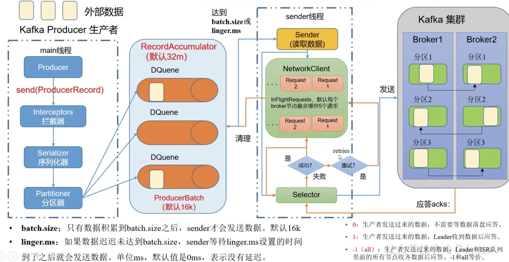

- batch.size：只有数据积累到 batch.size 后，sender 才会发送数据，默认 16k
- linger.size：如果数据迟迟未达到 batch.size，sender 等待 linger.size 时间后发送数据，默认 0ms 即没有延迟

#### 异步发送

#### 生产者分区
分区好处
- 便于合理使用存储资源，每个 partition 在一个 broker 上存储，可以把海量数据按照分区切割成一块一块数据存储在多台 broker 上。合理控制分区的任务，实现负载均衡的效果
- 提高并行度，生产者可以以分区为单位发送数据：消费者可以以分区为单位消费数据

设置分区与分区器
- 如果设置了分区则直接使用它
- 如果没有设置分区则使用 key 进行 hash 计算选择分区
- 如果分区和key都没设置，则都使用一个分区，在分区的 batch 满或已完成的时候切换分区（粘性分区器）

自定义分区器：
根据需求控制消息要发送的分区，返回分区数

#### 生产者提高吞吐量
- batch.size：批次大小，默认16k
- linger.size：等待时间，修改为 5-100ms
- compression.type：压缩 snappy
- RecordAccumulator：缓冲区大小，修改为64m


#### 数据可靠性
ACK 应答级别：
- 0：生产者发送的数据不需要等待数据落盘应答
  数据可靠性：数据可能未写到硬盘，丢数据
- 1：生产者发送的数据，Leader 收到数据后应答
  数据可靠性：可能在数据未同步到 follower 时 leader挂了，丢数据
- -1/all：生产者发送数据，Leader 和 ISR 队列里的所有节点收集齐数据后应答
  Leader 收到数据，所有 follower 开始同步数据，但如果有一个 follower 出现故障不能与 leader 同步，怎么解决？
  Leader 维护一个 动态的 in-sync replica set （ISR），意为和leader保持同步的 follower 集合
  如果 follower 长时间未向 leader 发送通信请求或同步数据，则该 follower 就会被踢出 ISR。该时间阈值由 replica.lag.time.max.ms 设置，默认30s
  数据可靠性：如果分区副本设置为1个，或者 ISR 里应答的最小副本量设置为1，和 ack = 1 的效果是一样的，仍有丢数据风险

完全可靠条件：ACK = -1 + 分区副本数 >= 2 + ISR 里应答的最小副本数量 >= 2

可靠性总结：
- ack=0：生产者发送数据后就不管了，可靠性差，效率高
- ack=1：生产者发送数据 Leader 应答，可靠性中等，效率中等
- ack=-1：生产者发送数据 Leader 和 ISR 里所有 Follower 应答，可靠性高，效率低
生产环境中 ack=0 很少使用，ack=1 一般用于普通日志，允许丢个别数据，ack=-1 一般传输和钱相关的数据，对可靠性要求比较高的场景


#### 数据去重
数据重复分析：
- ack=-1：生产者发送数据，Leader 和 ISR 队列里的所有节点收集齐数据后应答
  当所有节点同步数据后，在返回 ack 时 leader 挂了，此时会选举出新的 leader，由于上一次没有应答成功，新 leader 会接收数据，上一次 follower 已经同步过数据，此时他成为了 leader，又接收了一次数据，造成数据重复

##### 数据传递语义
- 至少一次（At Last Once）：ack=-1 分区副本数>=2  ISR 里应答的最小副本数量 >=2
  保证数据不丢，但是不能保证数据不重复
- 最多一次（At Most Once）：ack=0
  保证数据不重复，不能保证数据不丢失
- 精确一次（Exactly Once）：对于一些非常重要的信息，要求数据不能丢失也不能重复
  幂等性+至少一次
  幂等性和事物

##### 幂等性
Producer 无论向 Broker 发送多少条重复数据，Broker 只会持久化一条，保证了不重复
重复数据的判断标准：具有 \<PID, Partition, SeqNumber> 相同主键的消息提交时，Broker 只会持久化一条
- PID：Kafka 每次重启都会分配新的
- Partition：分区号
- SeqNumber：是单调自增的

所以 幂等性 只会保证在单分区会话内不重复

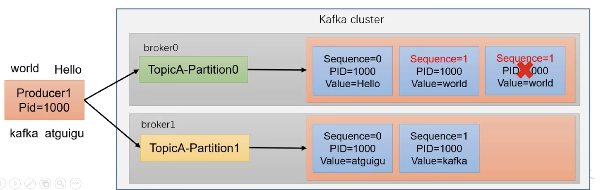

使用幂等性：开启 enable.idempotence 为 true

##### 生产者事务
开启事务必须开启幂等性


使用事务：
Kafka 的事务有5个 API：
- 初始化事务
- 开启事务
- 在事务内提交已经消费的偏移量（主要用于消费者）
- 提交事务
- 放弃事务（类似于回滚）


#### 数据有序
单分区内有序
多分区，分区之间无序

#### 数据乱序
生产者为每个 Broker 最多缓存5个请求，当其中的请求成功顺序不同时，会造成乱序

- 在 Kafka 1.x 版本之前保证数据单分区有序，条件如下：
  - max.in.flight.requests.per.connections = 1（不需要考虑是否开启幂等性）（队列里最多有一个请求）
- 在 1.x 版本后
  - 未开启幂等性
    - 同样设置最多一个请求
  - 开启幂等性
    - 设置请求数小于等于 5
      启用幂等性后，Kafka 服务端会缓存 producer 发送过来的 最近 5个 request 的元数据，故无论如何，都能保证进5个请求都是有序的
      到达服务端的请求会重新排序


## Broker

### Broker 的工作流程

#### Zookeeper 存储的 Kafka 信息
在 Zookeeper 的服务端中存储的 Kafka 相关信息
- /kafka
  - admin
  - brokers
    - ids 有哪些服务器
    - topics
      - first
        - partitions
          - 0
            - state：记录谁是 leader，有哪些服务器可用
  - cluster
  - consumers
  - controller
  - config
  - controller_epoch
  - log_dir_event_notification
  - latest_producer_id_block
  - isr_change_notification

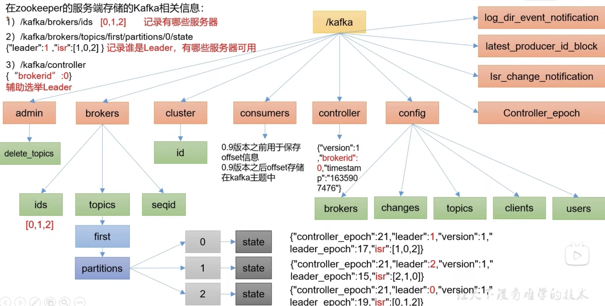


#### kafka broker 总体工作流程
1. broker 启动，在 zookeeper 中注册
2. 开始 选择 controller 节点
3. 由选举出的 COntroller 节点监听 broker 节点变化
4. Controller 决定 leader 选举
   规则：在 ISR 中存活为前提，按照在 AR 中排在前面的优先
   AR：Kafka 分区中所有副本的统称
5. controller 将节点信息上传 zk
6. 其他 controller 从 zk 同步信息

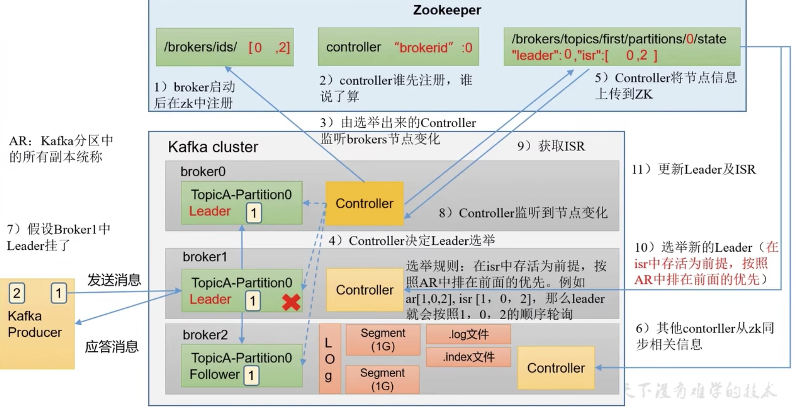


#### 节点的服役和退役
1. 准备新节点，开启 Kafka
2. 执行负载均衡操作
   1. 创建负载均衡 topic
      创建 topic-to-move.json
      ```json
      {
        "topics": [
          {
            "topic": "first"
          }
        ],
        "version": 1
      }
      ```
   2. 创建一个负载均衡计划
      ```shell
        kafka-reassign-partitions.sh --bootstrap-server 192.168.1.123:9092 --topic-to-move-json-file topic-to-move.json --broker-list "0,1,2,3" --generate
      ```
   3. 创建副本储存计划
      创建文件 increase-replication-factor.json
      ```json
        {
          "version": 1,
          "partitions": [
            {
              "topic": "first",
              "partition": 0,
              "replicas": [3, 1],
              "log_dirs": ["any", "any"],
              
            }
          ]
        }
      ```
   4. 执行副本储存计划
      ```shell
      kafka-reassign-partitions.sh --bootstrap-server 123 --reassignment-json-file increase-replication-factor.json --execute
      ```
   5. 验证副本储存计划
      ```shell
      kafka-reassign-partitions.sh --bootstrap-server 123 --reassignment-json-file increase-replication-factor.json --vertify
      ```

退役旧节点：
执行负载均衡操作，把数据导入到其他节点上，关闭该节点
同增加新节点

### Kafka 副本
- 副本作用：提高可用性
- Kafka 默认副本1个，生产环境一般配置为2个，保证数据可靠性；太多副本会增加磁盘空间和网络占用，降低效率
- Kafka 中副本分为 leader 和 follower，生产者只会把数据发送到 leader，然后 follower 会找 leader 同步数据
- Kafka 分区中的所有副本统称为 AR（assigned replicas）
  - AR = ISR + OSR
    - ISR：和 Leader 保持同步的 Follower 集合
    - OSR：同步时延迟高的副本


#### Leader 选举流程


#### Leader 和 Follower 故障处理
- LEO（Log End Offset）：每个副本的最后一个 offset，LEO = offset + 1
- HW（Hight Watermark）：所有副本中最小的 LEO


- Follower 发生故障
  - 被踢出 ISR
  - Leader 和 Follower 继续接收数据
  - Follower 恢复后，Follower 会取磁盘中上次的 HW，并将 log 文件高于 HW 的部分截取掉，从 HW 开始向 Leader 同步
  - 等到该 Follower 的 LEO 大于等于 该 Partition 的 HW，即 Follower 追上 Leader 后，将重新加入 ISR

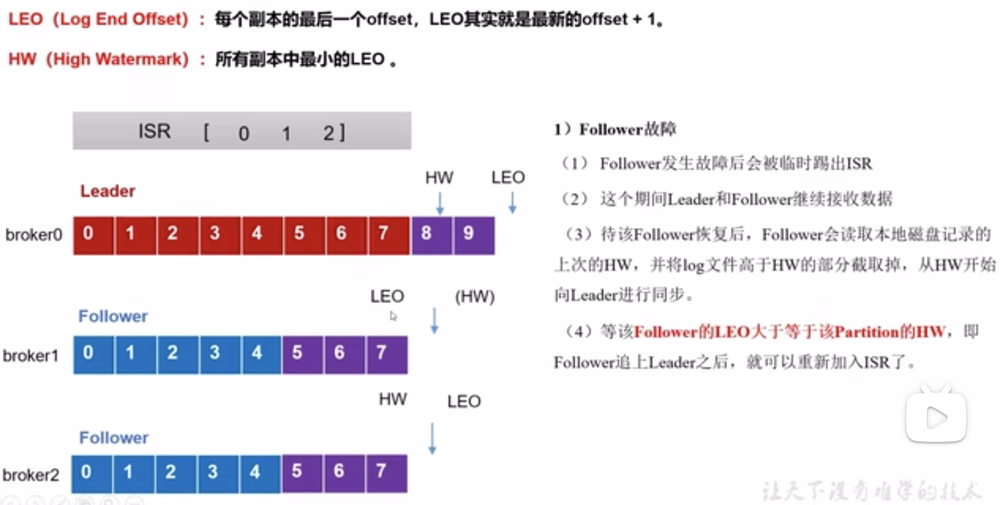

- Leader 故障
  - 从 ISR 中选举新 Leader
  - 为保证多副本间数据统一性，其余 Follower 会将各自 log 文件高于 HW 的部分截取掉，然后从新 Leader 同步数据
  - 只能保证副本间数据的统一性，不能保证数据不丢失和不重复


#### 分区副本分配
如果设置的分区数大于 broker 节点数，Kafka 会怎么分配呢？
尽量均匀分配
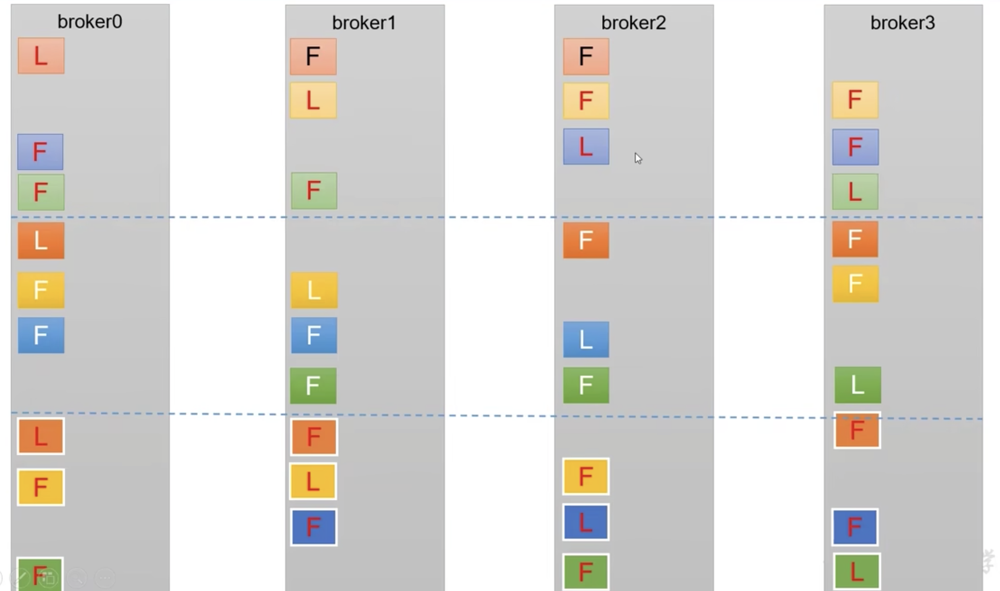

#### 手动调整分区副本存储
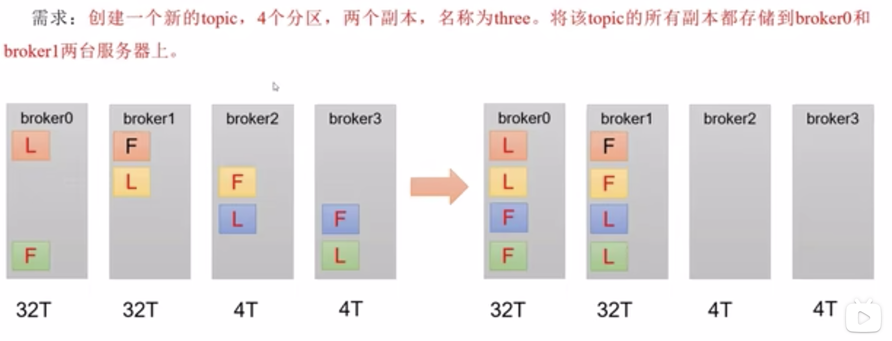

1. 创建 topic，4个分区，2个副本
2. 创建副本存储计划
   创建文件 incress-replication-factor.json
   ```json
   {
    "version": 1,
    "partitions": [
      {
        "topic": "three",
        "partition": 0,
        "replicas": [0, 1]
      },
      {
        "topic": "three",
        "partition": 1,
        "replicas": [0, 1]
      },
      {
        "topic": "three",
        "partition": 2,
        "replicas": [1, 0]
      },
      {
        "topic": "three",
        "partition": 3,
        "replicas": [1, 0]
      },
    ]
   }
   ```
3. 执行副本存储计划
   ```shell
   kafka-reassign-partitions.sh --bootstrap-server 123 --reassignment-json-file incress-replication-factor.json --execute
   ```
4. 验证副本存储计划


#### Leader Partition 负载均衡
正常情况下，Kafka 本身会自动把 Leader Partition 均匀分散在各个机器上，来保证每台机器的读写吞吐量都是均匀的，但是如果某些 broker 宕机，会导致 Leader Partition 会过于集中分布在某几台机器上，这会导致这几台机器压力过高，其他宕机的 broker 重启后都是 Follower Partition，读写请求很低，导致负载不均衡

auto.leader.rebalance.enable = true  自动 Leader Partition 平衡
leader.imbanlance.per.broker.percentage  默认 10% ，每个 broker 允许不平衡的 leader 的比例，如果每个 broker 超过了这个值，控制器会触发 leader 平衡
leader.imbanlance.check.interval.seconds  默认 300s，检查 leader 是否平衡的间隔时间


最好不要频繁触发自动平衡，因为会浪费集群性能

#### 增加副本因子
在生产环境中。由于某个主题的重要等级需要提升，我们考虑增加副本，副本数的增加需要先制定计划，然后根据计划执行
1. 创建 topic
2. 手动增加副本存储
   1. 创建副本存储计划
   2. 执行副本存储计划


### 文件存储
#### 文件存储机制
topic 是逻辑上的概念，而 partition 是物理上的概念，每个 partition 对应一个 log 文件，该 log 文件中存储的就是 producer 生产的数据
producer 生产的数据会不断的追加到 log 文件的末尾
为防止 log 文件过大导致数据定位效率低下，Kafka 采取了 分片 和 索引 机制，将每个 partition 分为多个 segment，每个 segment 包括 `.index 偏移量索引  .log 日志  .timeindex 时间戳索引`等文件，这些文件位于一个文件夹下，该文件夹的命名规则为`topic名+partition序号`，例如：first-0

segment 最大 1G，默认保存 7 天，7天后会删除超时的数据
文件命名规则：segment 的第一条消息的 offset 命名

log 文件 和 index 文件详情：
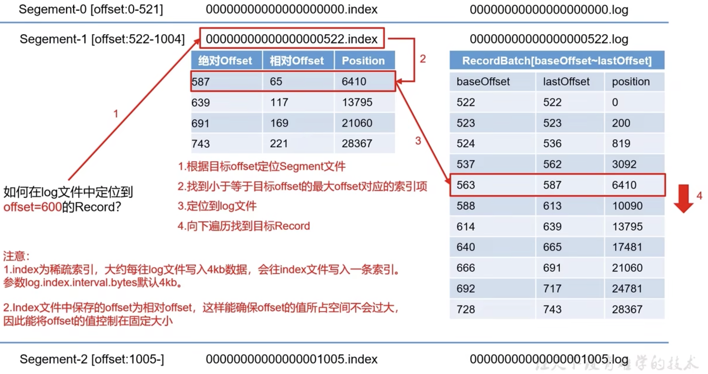


文件清理策略：
默认日志保存时间 7天
- delete 策略
  - 将过期数据删除
  - 基于时间：以 segment 中所有记录中的最大时间戳作为该文件时间戳
  - 基于大小：超过设置的所有日志的总大小，删除最早的 segment
- compact 策略
  - 日志压缩：对于相同 key 的不同 value，只保留最后一个版本
  - 压缩后的 offset 可能不是连续的
  - 这种策略只适合特殊场景，例如消息的 key 是用户ID，value 是用户资料


### 高效读写数据
1. Kafka 本身是分布式集群，可采用分区技术，并行度高
2. 读数据采用稀疏索引，可以快速定位要读取的数据
3. 顺序写磁盘
   1. producer 产生的数据要追加到 log 文件中，写的过程是一直追加到文件末端，为顺序写，
4. 页缓存+零拷贝
   1. 零拷贝：Kafka 的数据加工处理操作交由生产者和消费者处理，Broker 不关心存储的数据，所以就不用走应用层，传输效率高
   2. 页缓存：Kafka 重度依赖底层操作系统提供的 PageCache 功能。当上曾有写操作时，操作系统只是将数据写入 PageCache，当读操作发生时，先从 PageCache 中查找，如果找不到，再去磁盘中找


## 消费者

### 消费方式
pull 模式：consumer 主动从 broker 中拉取数据
不足之处：如果 Kafka 没有数据，消费者会陷入循环中，一直返回空数据

### 总体工作流程
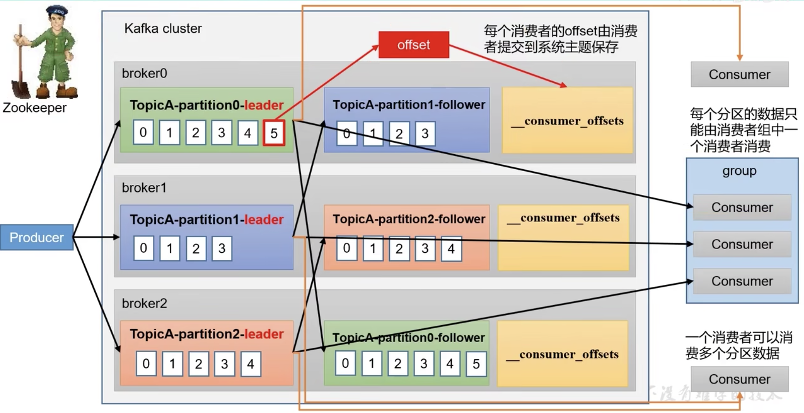

### 消费者组原理
消费者组由多个 consumer 组成，形成一个消费者组的条件是：多个消费者的 group_id 相同
- 消费者组内的每个消费者负责消费不同分区的数据，一个分区只能由一个组内消费者消费
- 消费者组间互不影响，所有的消费者都属于某个消费者组，即消费者组是逻辑上的一个订阅者

如果消费者组内的消费者数量大于分区数量，那么就会有消费者闲置，不会接收任何消息

#### 消费者组初始化流程
1. coordinator：辅助实现消费者组的初始化和分区分配
   1. coordinator 的节点选择 = hash(groupid) % 50 (__consumer_offsets 的分区数量)
      例如：groupid 的 hashcode 值为 1，1 % 50 = 1，那么 __consumer_offsets 的1 号分区在哪个 broker 上，就选择这个节点的 coordinator 作为这个消费者组的老大，消费者组下所有的消费者提交 offset 时就往这个分区提交

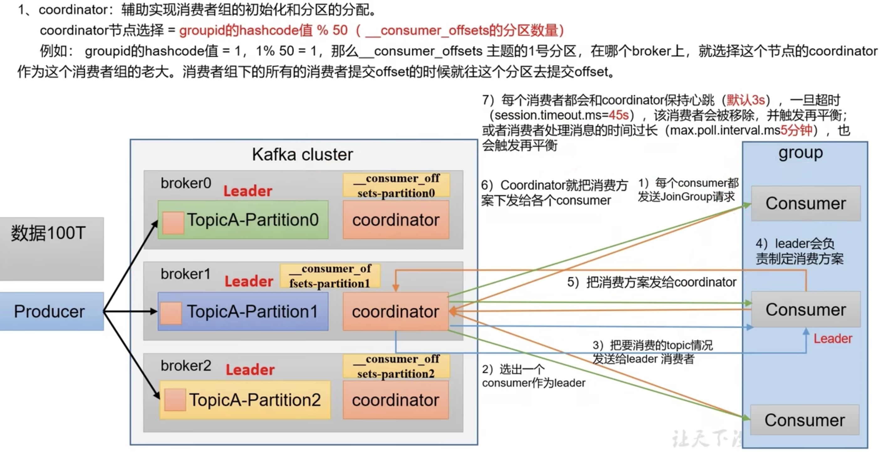

#### 消费者组消费流程
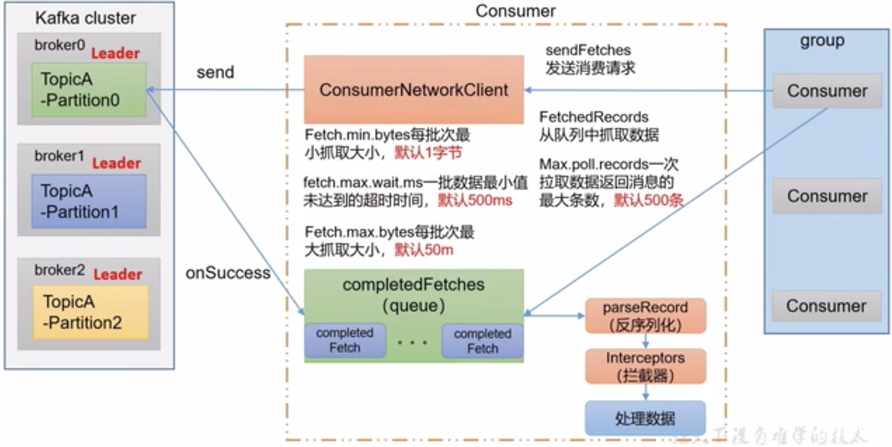


### 分区分配及再平衡
Kafka 有4中主流分区分配策略：
1. Range
   Range 是对每个 topic 而言的
   首先对同一个 topic 里的 partition 按照分区号进行排序，并对消费者按照字典序进行排序
   通过 分区数/消费者数 来决定每个消费者应该消费几个分区，如果除不尽，排在前面的消费者多消费一个分区
   如果只有一个 topic，前面的消费者多消费一个分区影响不是很大，但如果有多个 topic，前边的消费者会多消费多个分区，容易产生数据倾斜
2. RoundRobin
   针对集群中所有的 topic 而言
   轮训分区策略，把所有的 partition 和 consumer 都列出来，然后按照 hashcode 排列，最后通过轮询算法来把 partition 分配给消费者
3. Sticky
4. CooperativeSticky


### offset 维护位置
0.11 早版本在 zookeeper，之后在 Kafka 本机


#### 自动提交 offset
相关参数：
- enable.auto.commit：是否开启自动提交，默认 true
- auto.commit.interval.ms：自动提交时间间隔，默认 5s

#### 手动提交 offset
手动提交有两种：
- 同步提交
- 异步提交

都会将本次提交的一批数据的最高偏移量提交，不同点是，同步提交会阻塞当前线程，一直到提交成功，并且会自动失败重试，而异步提交是没有重试机制的，有可能提交失败

#### 指定 offset 进行消费
auto.offset.reset = earliest | latest | none  默认 latest

当Kafka 中没有初始偏移量（消费者组第一次消费）或服务器上不再存在当前偏移量时（例如该数据已被删除）该如何处理？
- earliest：自动将偏移量设置为最早的偏移量 --from-beginning
- latest：自动设置为最新偏移量
- none：如果未找到消费者组的先前偏移量，抛出错误


#### 指定时间消费


#### 漏消费和重复消费
- 漏消费：先提交 offset 后消费
- 重复消费：已消费数据，但是没有提交 offset


场景1:
  重复消费
  在使用自动提交时，自动提交时间间隔5s，当消费数据还未提交时（上次提交后5s内）消费者宕机，重启消费者，会在上次提交的位置消费，而之前已消费但未提交的部分就被重复消费
场景2:
  漏消费
  在使用手动提交时，消费者拿到数据后进行手动提交，但在数据还未处理时宕机，重启后会从新的 offset 消费，上一个提交但未处理的消息就被漏消费

这些情况可使用消费者事务解决

### 消费者事务
如果想完成 consumer 端的精准一次性消费，那么需要 Kafka 消费端将消费过程和提交 offset 过程做原子绑定
此时我们需要将 Kafka 的 offset 支持事务的自定义介质（如 MySql）

### 数据积压（提高消费者吞吐量）
- 如果是 Kafka 消费能力不足，则可以考虑增加 topic 分区数，并同时提升消费组消费者数量，消费者数 = 分区数，两者缺一不可
- 如果是下游的数据处理不及时：提高每批次拉取的数量。批次拉取数据过少（拉取数据/处理时间<生产速度），使处理的数据小于生产的数据，也会造成积压


## Kafka Eagle 监控
1. 安装 MySql
2. 修改 Kafka 配置
3. 安装 kafka-eagle
   1. 下载安装包，解压
   2. 修改配置
   3. 启动


## Kafka Kraft 模式

## Kafka 调优


